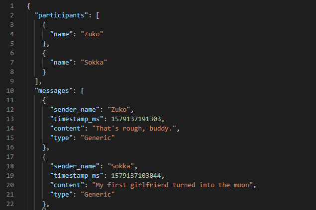
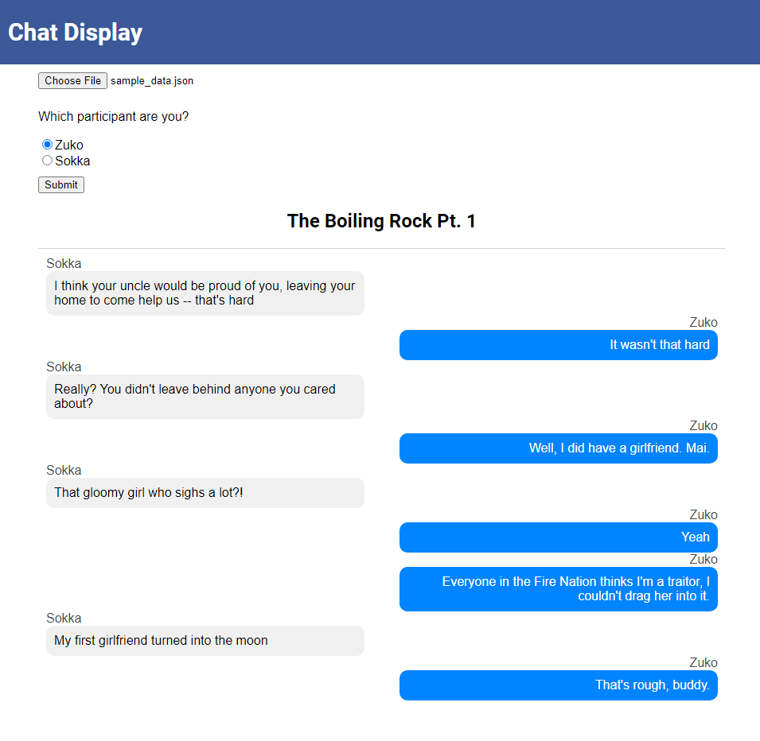

# Facebook-Messenger-JSON-viewer
If you've downloaded your Facebook data in JSON format, this tool lets you read the chats more intuitively.
Useful if you've deleted Facebook, but downloaded your JSON data.

**TL;DR** [here's the link to try it out](https://simonwong.io/fb_chat_viewer/)

As raw JSON, it's hard to read and it's in reverse chronological order:

Using this Facebook Messenger JSON viewer, it looks much better:

## How to use

Here's a quick demo:

### Step 1.
#### Method 1
I have this tool [hosted on my website](https://simonwong.io/fb_chat_viewer/). You can select your JSON files and all the data will be processed client-side so you don't have to worry about me reading your chats 😁

#### Method 2
Clone this repo and run `chat_display.html` on your browser.

### Step 2.
Once you've opened the link or cloned the repo and opened the HTML file, you will need to choose your JSON file that you want to parse using the file selector.

After selecting your file, you'll be asked which participant you are. This will put your messages on blue bubbles on the right side, and everyone else's messages on the left, in grey bubbles.

Voilà, your chats can now be easily read.

## Ideas / TODO
* Do some advanced searching/filtering on the chat data in JSON format using my [Facebook Messenger tool](https://github.com/simonwongwong/Facebook-Messenger-Statistics/) and then view the messages using this viewer
* Add a slider or calendar picker to filter dates in the chat (not supported by Facebook Messenger unless you want to spend hours scrolling and loading).
* ~~Add tooltip to show timestamps of messages~~
* Functionality for viewing images/files sent in chat

## Bugs
* text decoding symbols and emojis currently not working
